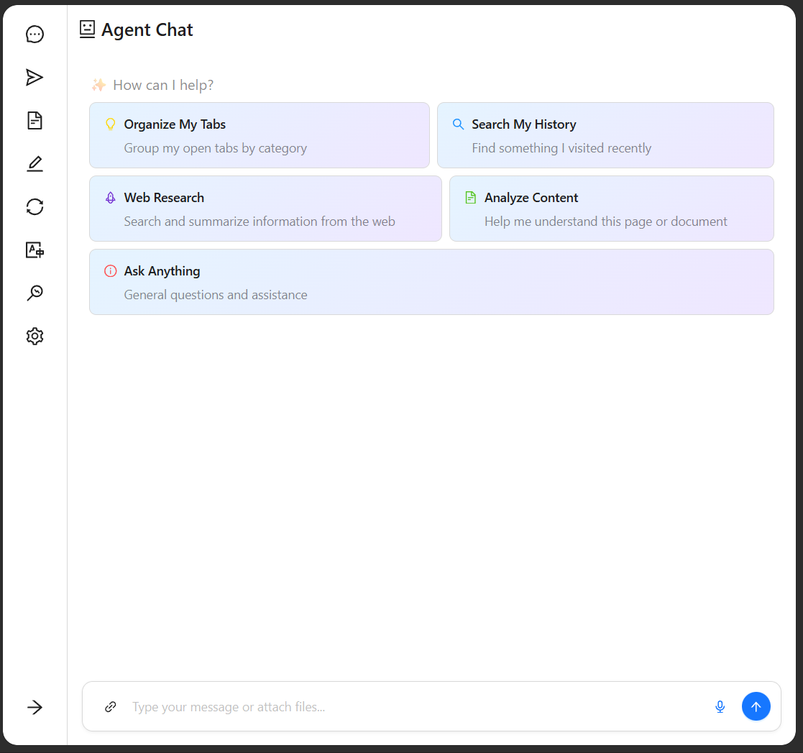
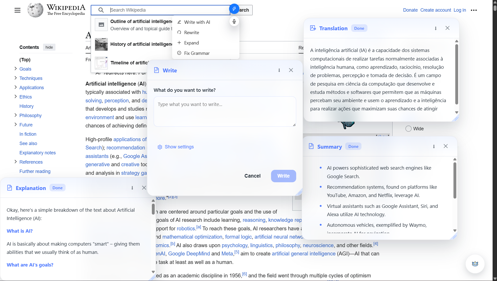
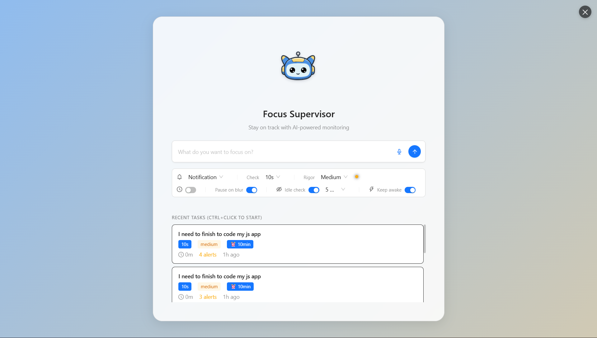

# Chad - Your Privacy-First AI Assistant

<div align="center">
  <a href="https://youtu.be/283wbSjQ-tM">
    
  </a>
</div>

Chad is a Chrome extension that leverages Chrome's built-in AI capabilities to provide a comprehensive, privacy-focused assistant that works entirely on your device. By utilizing the local AI models powered by Gemini Nano, Chad ensures your data never leaves your computer while delivering powerful AI assistance.

## ✨ Personalization
- Fully customizable AI personality to match your preferences
- Choose from three delightful mascot color themes
- Adaptable interaction style and tone

## 🌟 Key Features

### 🤖 Advanced AI Chat with Tool Integration
- Rich context-aware conversations using Chrome's Prompt API
- Built-in tool system for file handling and workspace interaction
- Support for multimodal inputs including text, images, and voice

<div align="center">
  
  <br>
  <em>Agent Chat Interface</em>
</div>

### 📝 In-Page Assistance
- **Smart Summarization**: Quick distillation of complex content using Summarizer API
- **Translation**: Real-time multilingual support via Translator API
- **Text Enhancement**:
  - Writer assistance with Writer API
  - Smart rewriting with Rewriter API
  - Grammar improvements
  - Text expansion capabilities
- **Image Analysis**: Advanced image interrogation using multimodal capabilities
- **Voice Interaction**: Voice-to-text conversion for natural interaction
<div align="center">
  
  <br>
  <em>In Page Assistance</em>
</div>

### 👀 Supervisor Mode
- Real-time screen monitoring for task focus
- Customizable alerts and notifications
- Voice and text-based interventions
- Privacy-preserving local processing

<div align="center">
  
  <br>
  <em>Supervisor Mode Interface</em>
</div>

### 🎙️ Voice Integration
- Dual voice system support:
  - Kokoro for enhanced voice synthesis
  - Native browser speech capabilities
  - Works entirely offline

### 🧪 AI Playground
Fully customizable workspace for:
- Text summarization
- Creative writing
- Content rewriting
- Translation
- Custom prompt experimentation

## 🔒 Privacy-First Approach
Chad is built with privacy at its core:
- Uses Chrome's built-in AI models and other open source models
- All processing happens locally on your device
- No data transmission to external servers
- Works offline by default (except during setup)

## 🛠️ Technical Implementation

### Enhanced AI API Integration
Sophisticated wrapper system around Chrome's built-in AI APIs with advanced capabilities:

#### Core Components
- **LanguageModelEx**: Advanced implementation extending Chrome's Language Model API
  - Smart context management with quota monitoring
  - Automatic history handling and summarization
  - Custom event system for quota and context management

- **Agent System**: Sophisticated tool-calling framework
  - Type-safe tool definition and execution
  - Structured thinking and planning capabilities
  - Streaming property management for real-time updates

#### Extended API Implementations
- **SummarizerEx**: 
  - Progressive summarization for large content
  - Multiple summarization strategies (merge/join)
  - Token-aware chunking with TextSplitter

- **WriterEx & RewriterEx**:
  - Advanced content generation handling
  - Configurable large content strategies
  - Progressive writing with context preservation

- **TranslatorEx**:
  - Unified translation and language detection
  - Automatic source language detection
  - Stream transformation support
  - Real-time chunk-based translation

### Advanced Features Architecture

#### Audio & Speech Processing
- **Unified Speech System**:
  - Dual engine support (Kokoro and Browser Speech)
  - Smart text chunking for long content
  - Customizable voices and languages
  - Streaming speech capabilities
  - Real-time speech feedback

- **Audio Processing**:
  - Automatic chunk management

#### Monitoring & Task Management
- **Screen Monitoring**:
  - Efficient frame capture system
  - Multi-monitor support
  - Customizable capture options

- **Task Orchestration**:
  - Hybrid task scheduling system
  - Intelligent interval management
  - Chrome Alarms API integration
  - Precise timing control

#### User Experience & Preferences
- **User Preferences System**:
  - Persistent settings storage
  - Multiple mascot variants
  - Customizable AI persona
  - Language preferences
  - Voice settings

- **Extension Integration**:
  - Tab management utilities (+-)
  - Screenshot capabilities
  - Content extraction tools
  - Background processing
  - Cross-context messaging

### Core Architecture Components

#### Smart Processing
- **Text Processing**:
  - Token-aware splitting
  - Balanced chunk distribution
  - Sentence boundary preservation

- **Performance Optimization**:
  - Quota management system
  - Predictive context handling

#### Security & Privacy
- **Data Protection**:
  - Local processing focus
  - Permission management
  - Secure data handling
  - Resource cleanup
  - Privacy-first design

## 🎯 Challenge Focus
This project was developed for the [Google Chrome Built-in AI Challenge 2025](https://googlechromeai2025.devpost.com/), specifically focusing on:
- Maximizing the use of Chrome's built-in AI capabilities
- Implementing innovative multimodal interactions
- Creating a helpful, privacy-preserving user experience
- Demonstrating the power of client-side AI processing

[🏆 View Challenge Details](https://googlechromeai2025.devpost.com/)

## 🚀 Getting Started

### Important Note About Installation
Due to Chrome Origin Trials requirements and API access restrictions, it's recommended to use the provided `.crx` file for installation to ensure all features work correctly. The extension ID is tied to specific API permissions and origin trial tokens.

### Quick Access
- **Keyboard Shortcut**: Press `Ctrl+Q` to open Chad's sidepanel
- **Omnibox**: Type `chad` in the address bar then press `Tab` to access Chad's commands

### Installation Options

#### Recommended: Using .crx File
1. Download the provided `.crx` file
2. Open chrome://extensions/
3. Drag and drop the `.crx` file into the extensions page

#### Development Setup
1. Clone the repository
2. Install dependencies:
   ```bash
   npm install
   ```
3. Run the extension:
   ```bash
   npm run dev
   ```
4. Load the extension in Chrome:
   - Open chrome://extensions/
   - Enable Developer mode
   - Click "Load unpacked"
   - Select the `dist` folder

## 💻 System Requirements

To ensure optimal performance of Chrome's built-in AI features, your system should meet the following specifications:

### Operating Systems
- Windows 10 or 11
- macOS 13+ (Ventura and newer)
- Linux
- ChromeOS (Platform 16389.0.0+) on Chromebook Plus devices only

### Hardware Requirements
- **Storage**: 22 GB minimum free space on Chrome profile volume
- **Memory**: 16 GB RAM minimum
- **Processor**: 4 CPU cores minimum
- **GPU** (if using GPU acceleration): More than 4 GB VRAM

### Network
- Unlimited data or unmetered connection recommended

### Warning
- This extension was only tested on Windows 11

### Not Supported
- Chrome for Android
- iOS
- ChromeOS on non-Chromebook Plus devices

## 📝 License

This project is licensed under the MIT License - see the LICENSE file for details.

## 📋 Development Note

This project underwent a significant pivot during the challenge period to better align with Chrome's built-in AI capabilities. Due to this mid-challenge strategic shift, some aspects of the codebase may appear very messy. Code organization improvements and further refinements are planned but will be implemented after the challenge judging period to maintain submission integrity.

Key points about the current state:
- Repository structure reflects rapid pivot to new architecture
- Some code organization improvements pending
- Core functionality fully implemented and tested
- Further refinements planned post-judging

---

<div align="center">
  
  <br>
  <em>Built for the Google Chrome Built-in AI Challenge 2025</em>
</div>
